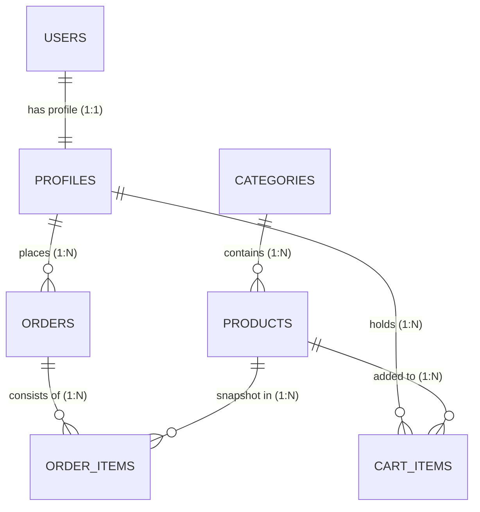

# CLE Perfume Platform: Complete Database Architecture Documentation

This document provides a comprehensive overview of the database design for the **CLE Perfume** platform. The system is built on **Supabase (PostgreSQL)** and follows a modular schema to support E-commerce, Admin Management, and Secure Payments.

---

## 1. Core Architecture Overview
The database uses a **Relational Schema** designed for high data integrity and security.

### Key Features:
- **RBAC (Role-Based Access Control)**: Managed via the `profiles` table to distinguish between `customer` and `admin`.
- **Automated Workflows**: Triggers automatically create profile records upon user signup.
- **Inventory Logic**: Database functions handle stock decrementing during successful checkout.
- **Audit Ready**: Every table tracks `created_at` timestamps for business reporting.

---

## 2. Entity Relationship Diagram (ERD)

---

## 3. Data Dictionary (Schema Details)

### A. Identity & Access Control
| Table | Column | Type | Description |
| :--- | :--- | :--- | :--- |
| **profiles** | `id` | UUID (PK) | References `auth.users.id` |
| | `role` | TEXT | 'customer' or 'admin' (Default: 'customer') |
| | `first_name` | TEXT | User's first name |
| | `last_name` | TEXT | User's last name |
| | `phone` | TEXT | Contact number |

### B. Catalog Management
| Table | Column | Type | Description |
| :--- | :--- | :--- | :--- |
| **categories** | `id` | UUID (PK) | Unique identifier |
| | `name` | TEXT | Category name (e.g., 'Men Fragrances') |
| | `slug` | TEXT | URL-friendly name |
| **products** | `id` | UUID (PK) | Unique identifier |
| | `category_id` | UUID (FK)| Linked to `categories.id` |
| | `name` | TEXT | Product name |
| | `price` | DECIMAL | Base price in AED |
| | `stock_quantity`| INT | Real-time inventory count |
| | `images` | TEXT[] | Array of image URLs |

### C. Order & Transaction Ledger
| Table | Column | Type | Description |
| :--- | :--- | :--- | :--- |
| **orders** | `id` | UUID (PK) | Unique identifier |
| | `user_id` | UUID (FK)| Linked to `profiles.id` |
| | `total` | DECIMAL | Final amount paid (Price + VAT) |
| | `status` | TEXT | pending, paid, shipped, etc. |
| | `tax` | DECIMAL | 5% VAT (Standard UAE) |
| | `shipping_address`| JSONB | Full structured address |
| **order_items**| `product_name` | TEXT | Snapshot of name at purchase |
| | `price` | DECIMAL | Snapshot of price at purchase |
| | `metadata` | JSONB | Contains **Personal Engraving** details |

---

## 4. Advanced Logic & Security

### Row Level Security (RLS) Policies
- **Public**: Can view `products` and `categories`.
- **Customers**: Can only view/update their *own* `profiles`, `cart_items`, and `orders`.
- **Admins**: Bypass RLS to view all system data (Global Dashboard access).

### Database Functions
1. **`handle_new_user()`**: An internal trigger that syncs Supabase Auth metadata to the `profiles` table automatically.
2. **`decrement_stock()`**: A procedure called by the backend webhook to ensure inventory is subtracted only after a verified payment.

---

## 5. Maintenance Commands
To initialize or reset the database, use the provided `initial_schema.sql` script located in the project root.

> [!IMPORTANT]
> **VAT Calculation**: All invoices generated via the Admin Dashboard use the `tax` column which is calculated as `subtotal * 0.05`. Ensure this logic aligns with your regional tax requirements.
