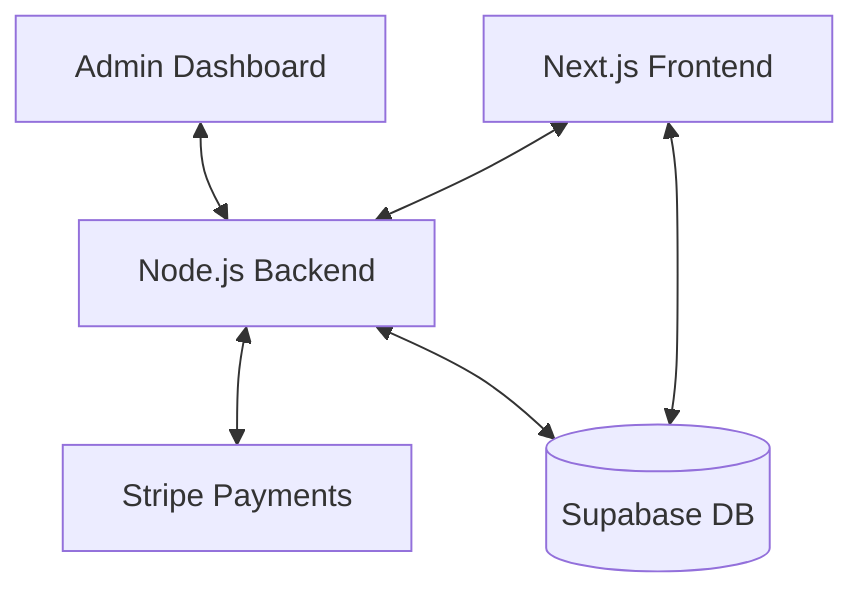

# 🦅 CLE Perfumes — Full-Stack Master Hub

Welcome to the complete project repository for CLE Perfumes. This project is structured as a **Consolidated Workspace** to keep the Frontend, Backend, and Database perfectly organized.

## 📁 Project Structure
```text
JustSearch/
├── clt-perfume-frontend/  # 💻 Next.js Frontend & Admin UI
└── clt-perfume-backend/   # ⚙️ Node.js API, Stripe, & Order Processing
```

## 🚀 Quick Access Links
| Part | Description | Documentation |
| :--- | :--- | :--- |
| **Frontend** | Luxury E-commerce Website | [View Docs](docs/PROJECT_OVERVIEW.md) |
| **Database** | Supabase (PostgreSQL + Auth) | [View Schema](docs/DATABASE_SCHEMA.md) |
| **Backend** | Express API + Stripe Payments | [View Features](docs/PART2_FEATURES_AND_DEPLOY.md) |
| **Admin** | Managing Orders & Products | [View Checklist](docs/IMPLEMENTATION_PLAN.md#phase-8-admin-dashboard) |

---

## 🛠️ System Architecture


## 🚦 Current Status
- [x] Frontend Responsive Design
- [x] Database Schema Design
- [x] Supabase Auth Integration
- [x] Node.js Backend Scaffolding
- [ ] **NEXT STEP:** Implementing the Admin Dashboard UI

---

## 📖 Complete Documentation index
- [Project Overview](docs/PROJECT_OVERVIEW.md)
- [Database & Auth setup](docs/PART1_DATABASE_AND_AUTH.md)
- [Stripe & Payments](docs/PART2_FEATURES_AND_DEPLOY.md)
- [Step-by-Step Build Plan](docs/IMPLEMENTATION_PLAN.md)
